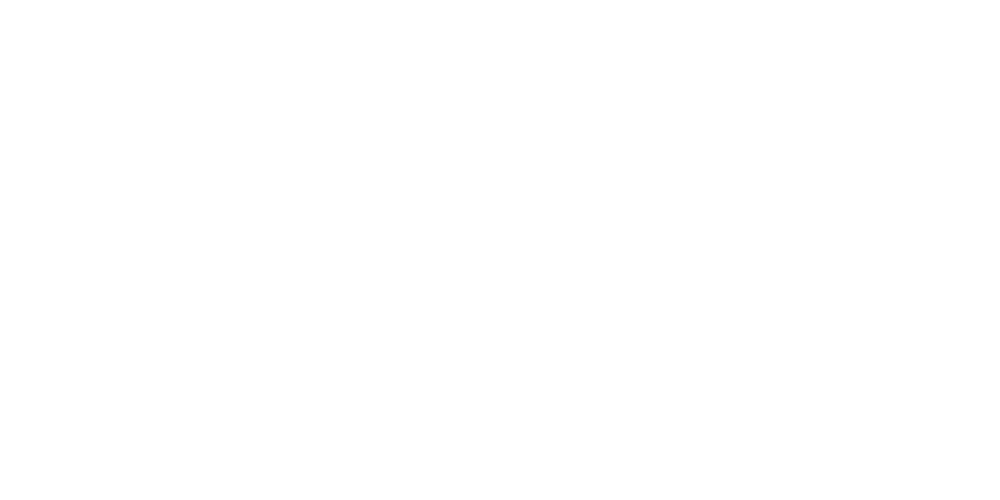

# ⚡ CRXJS React starter + TypeScript + TailwindCSS

This template is for creating Chrome extension, using [Vite](https://vitejs.dev/), [CRX](https://crxjs.dev/vite-plugin/) plugin, [React](https://react.dev/), [TailwindCSS](https://tailwindcss.com/) and [TypeScript](https://www.typescriptlang.org/).

## What this template contains?

- Extension popup
- Content scripts
- Extension background
- New tab page
- Welcome page

## How to use

- Click the use [Use this template](https://github.com/cresvin/crxjs-react-starter/generate) button or clone this repo.

```bash
# Install dependencies
npm install

# Run extension as dev mode
npm run dev

# Build extension
npm run build
```

## Example Usage

**To use the popup**:

1. Navigate to the `src/pages/popup/popup.tsx` directory.
2. Modify the files as needed.
3. Run npm run dev to see changes in real-time.
4. Once satisfied, build the extension using npm run build.

## Useful Links

- [Vite Documentation](https://vitejs.dev/)
- [CRX Documentation](https://crxjs.dev/vite-plugin/)
- [React Documentation](https://react.dev/)
- [TailwindCSS Documentation](https://tailwindcss.com/)
- [TypeScript Documentation](https://www.typescriptlang.org/)
